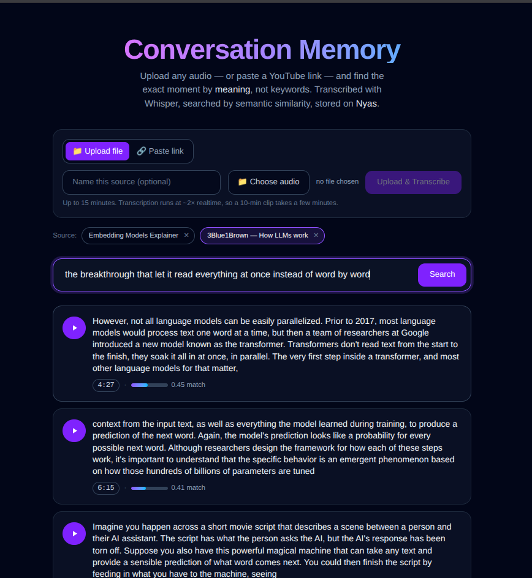
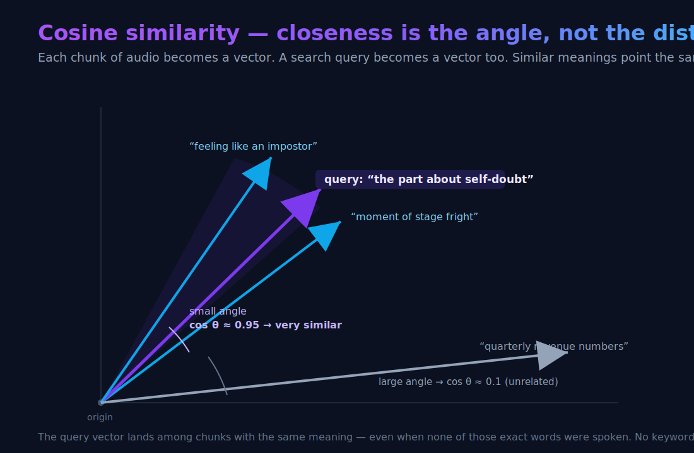

# Conversation Memory

**Upload any audio — or paste a YouTube link — and jump to the exact moment by *meaning*, not keywords.**

Search "the part where they talk about self-doubt" and it finds that passage even if nobody said those words — then plays the audio from that exact second.

No LLM in the loop. Just speech-to-text, embeddings, and cosine similarity — all running locally and free.

---

## Demo

[](demo.mp4)

▶ **[Watch the demo](demo.mp4)** — paste a link, search by meaning, and jump to the exact moment. *(Click the screenshot above.)*

---

## What it does

1. **Add a source** — upload an audio file, or paste a YouTube / media URL (the backend pulls the audio with `yt-dlp`).
2. **Whisper** transcribes it into timestamped segments, which are merged into ~25-second chunks (each holding a complete thought).
3. Each chunk is turned into an **embedding** (a vector that captures meaning).
4. **Search** in plain language — the query is embedded too, and chunks are ranked by **cosine similarity**.
5. Selecting a result **seeks the audio to that moment** and plays just that passage.

```
audio ─► Whisper (timestamps) ─► ~25s chunks ─► embeddings ─► Postgres
                                                                  │
search query ─► embedding ───────────► cosine similarity ◄────────┘
                                              │
                                        ranked moments ─► play from timestamp
```

## Why it's interesting

- **Semantic, not lexical.** Keyword search fails when the words don't match the idea. Embeddings match the *meaning*.
- **No LLM.** No hallucination, no API cost, no latency — retrieval is a single matrix multiply.
- **Real moments.** Results aren't summaries; they're playable audio with a timestamp.

## Built on [Nyas](https://nyas.io)

This uses all three Nyas primitives:

| Nyas primitive | Used for |
| --- | --- |
| **Postgres** (relational) | source files + their processing status |
| **Postgres** `REAL[]` column | the embedding vectors (cosine search in NumPy — pgvector not needed) |
| **S3-compatible storage** | the audio itself, streamed back for playback |

## Tech stack

- **Backend:** FastAPI · [faster-whisper](https://github.com/SYSTRAN/faster-whisper) (`medium`, CPU) · [sentence-transformers](https://www.sbert.net/) (`all-MiniLM-L6-v2`, 384-dim) · NumPy · [yt-dlp](https://github.com/yt-dlp/yt-dlp) (URL ingestion)
- **Frontend:** Next.js + React + Tailwind CSS
- **Infra:** Nyas (Postgres + S3)

---

## Run it locally

### Prerequisites
- Python 3.11+, Node 18+, and **ffmpeg** (Whisper uses it to decode audio)
- A free [Nyas](https://nyas.io) project (Postgres + a storage bucket named `audio`)

### 1. Backend

```bash
python -m venv .venv
source .venv/bin/activate

# Install CPU-only PyTorch first (no GPU needed; ~190 MB instead of several GB)
pip install torch --index-url https://download.pytorch.org/whl/cpu
pip install -r requirements.txt

# Configure credentials
cp .env.example .env        # then edit .env with Nyas project credentials

uvicorn app.api:app --port 8000
```

> The first run downloads the Whisper and embedding models (a few hundred MB) — give it a minute.

### 2. Frontend

```bash
cd web
npm install
npm run dev
```

Open **http://localhost:3000**, upload an audio file, wait for it to transcribe, and search.

---

## Notes & limits

- **15-minute cap** per file (keeps transcription fast for a demo).
- **mp3 and wav** are the most reliably playable formats in the browser.
- Transcription runs at roughly **2× realtime** on CPU, so a 10-minute clip takes a few minutes.
- Nyas storage doesn't serve HTTP range requests, so audio is streamed back through a small range-capable endpoint (`GET /api/sources/{id}/audio`) — that's what makes seeking to a timestamp work.

## How search works under the hood



Every sentence becomes a vector. Sentences with similar meaning point in similar **directions**, so the angle between them is small and their **cosine similarity** is close to 1; unrelated sentences sit at a wide angle, near 0.

Embeddings are unit-normalized, so **cosine similarity is just a dot product**. Searching a source is one `matrix @ query` over all its chunk vectors — fast, transparent, and no vector database required. The whole ranking lives in [`app/search.py`](app/search.py).
